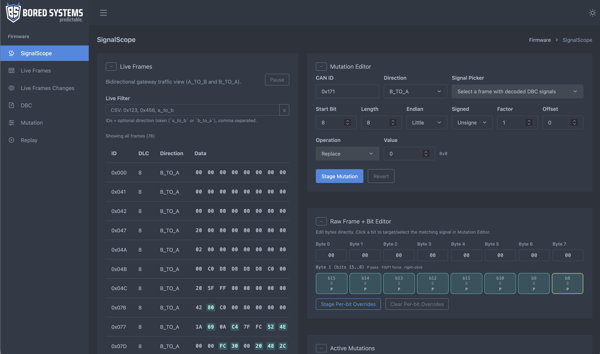
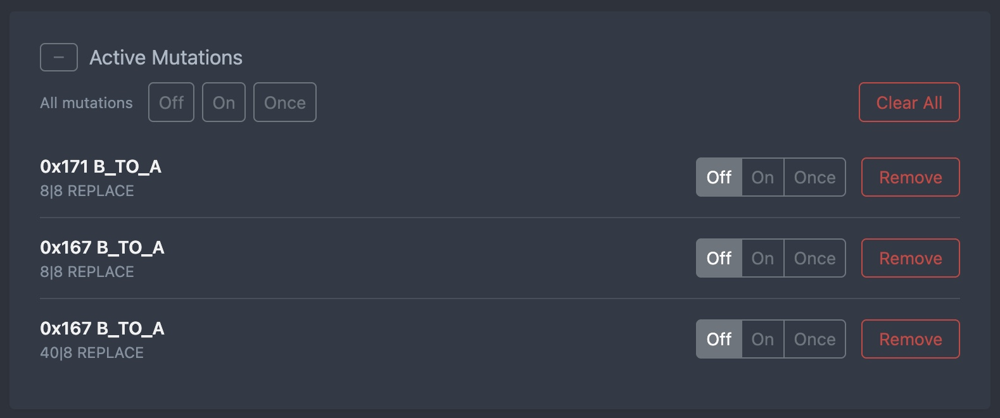
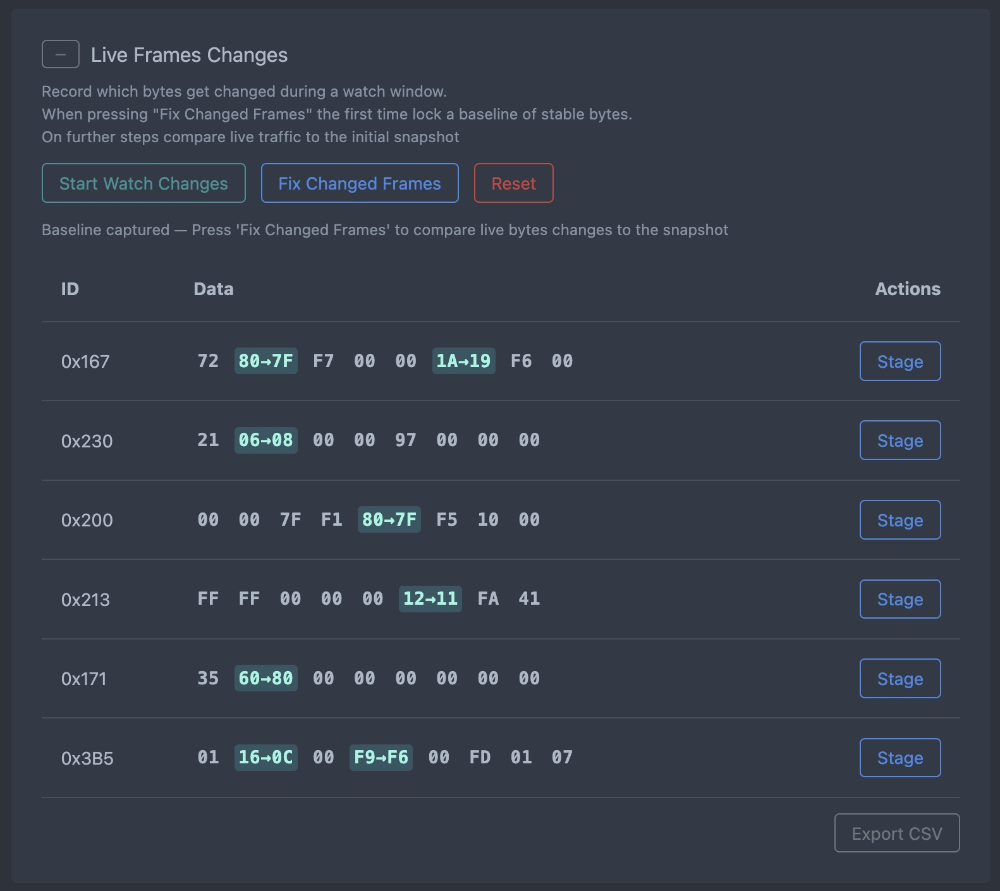
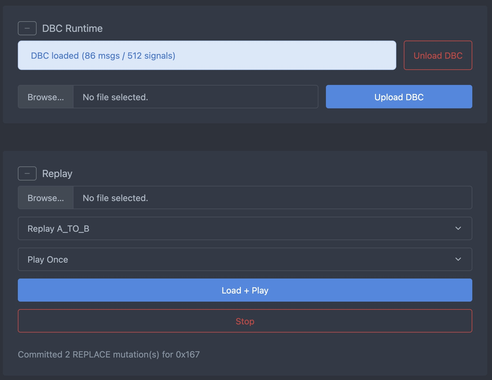
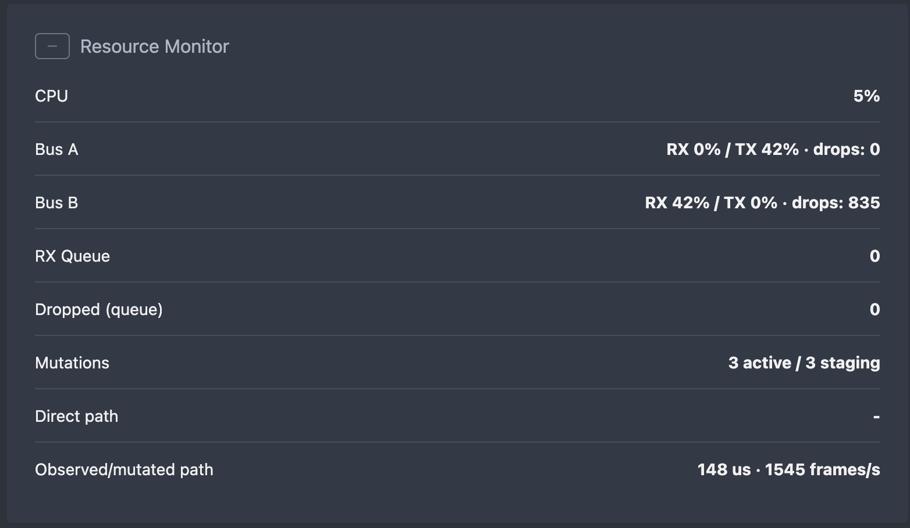

# SignalScope

SignalScope is a deterministic inline dual-CAN gateway firmware for ESP32-S3 + MCP2515 with an on-device web UI served from LittleFS.

## Current Capability Summary
- AP-hosted UI (`SignalScope-AP` / `signalscope`)
- Dual-bus live traffic view (`A_TO_B` + `B_TO_A`)
- DBC load (auto-load from `/dbc` on boot + manual upload)
- DBC decode in live view (message name + decoded signals)
- Staged rules engine (`BIT_RANGE`, `RAW_MASK`): `/api/rules/*` (legacy `/api/mutations/*` aliases)
- Per-rule enable/disable + dynamic value updates
- Live Frames Changes watch (baseline of stable bytes, then diff vs live traffic)
- Replay CSV load + play/stop/loop controls
- Resource monitor with queue/drop/latency and ingress counters

## Important Notes
- Live view is the **latest frame per CAN ID and direction** (hash cache, many rows), not a rolling history per ID.
- Mutation `mutated=true` means a mutation was applied to that frame instance.
- Legacy `/api/mutations/stage` (same as `/api/rules/stage`) accepts `REPLACE` and `PASS_THROUGH` only for `SignalMutation` staging; `ADD_OFFSET`, `MULTIPLY`, `CLAMP` appear in the UI but are not staged.

## Project Layout
- `main.cpp` firmware wiring, task runtime split, HTTP API, CAN IO
- `core/` gateway, mutation engine, replay engine, DBC parser, frame/signal caches
- `fs/` persistence stub (RAM-only helpers; not wired to flash from `main.cpp`)
- `data/` LittleFS payload (UI source)
- `boards/esp32-s3-devkitc1-n16r8.json` custom 16MB board definition
- `partitions.csv` partition layout (LittleFS label `littlefs`)

## Runtime Split
- CAN/runtime task pinned to core `0`
- UI/server task pinned to core `1`

This keeps web traffic from starving CAN forwarding.

## API Endpoints (Current)
Core:
- `GET /api/status`
- `GET /api/frame_cache`
- `GET /api/signal_cache`
- `POST /api/frame_changes/watch`
- `POST /api/observe`

Rules:
- `POST /api/rules/stage`
- `POST /api/rules`
- `GET /api/rules`
- `POST /api/rules/enable`
- `POST /api/rules/value`
- `POST /api/rules/mode`
- `POST /api/rules/mode_all`
- `POST /api/rules/remove`

Replay + DBC:
- `POST /api/replay`
- `POST /api/replay/load`
- `POST /api/dbc`
- `DELETE /api/dbc`

Legacy compatibility mappings:
- `POST /api/mutations/stage`
- `POST /api/mutations`
- `POST /api/mutations/mode`
- `POST /api/mutations/mode_all`
- `POST /api/mutations/remove`
- `POST /api/mutations/toggle`

## DBC Auto-Load Order
On boot, firmware attempts (first valid wins):
1. `/dbc/active.dbc`
2. `/dbc/default.dbc`
3. `/dbc/vw_pq.dbc`
4. first `*.dbc` found under `/dbc`

## Build Configuration
Pinned in `platformio.ini`:
- Platform: `https://github.com/pioarduino/platform-espressif32.git#55.03.36`
- Library: `autowp/autowp-mcp2515@1.3.1`

No floating (`^`) dependency ranges are used.

## Flash
From `G:\My Drive\SignalScope`:

```powershell
platformio run -t upload
platformio run -t uploadfs
```

First-time full reset (or suspect partition/filesystem state):

```powershell
platformio run -t erase
platformio run -t upload
platformio run -t uploadfs
```

## Connect
- SSID: `SignalScope-AP`
- Password: `signalscope`
- URL: `http://192.168.4.1/`

## Troubleshooting
- `LittleFS not mounted`: run `erase` -> `upload` -> `uploadfs`.
- `partition "spiffs" could not be found`: keep partition label as `littlefs`.
- UI missing/stale: ensure `data/index.html` exists, then `uploadfs` again.
- Live view sparse: verify `ingress_a_frames` and `ingress_b_frames` in `/api/status` are incrementing.










